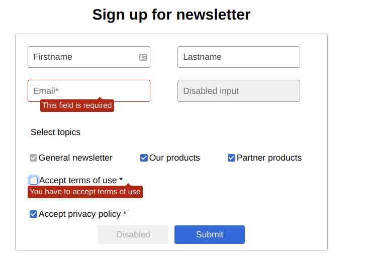

# Newsletter-form

## [Live demo](https://jovial-bell-2f4b94.netlify.app)

## Used libraries & resources
  - [react-hook-form](https://www.npmjs.com/package/react-hook-form)
  - [node-sass](https://www.npmjs.com/package/node-sass)
  - [create-react-app](https://create-react-app.dev/)

# Local installation

Here are the instructions to get the local development environment up and running. The instructions are for Windows but the steps for other environments should be similar.

## Cloning the repository
1. Ensure [Git](https://git-scm.com/downloads) and [Node.js](https://nodejs.org/en/) are installed.
2. Open Git Bash in the directory where you want the project to be saved.
3. Clone this repository with `git clone` using either HTTPS or SSH
4. Move to the created folder by typing `cd newsletter-form`.
5. Run `npm install`.

## To start the project
1. Use script `npm start`.
A local server should start up and you should be able to access the application with the address `http://localhost:3000/`. Any changes made to the code should be visible instantly on your browser.
